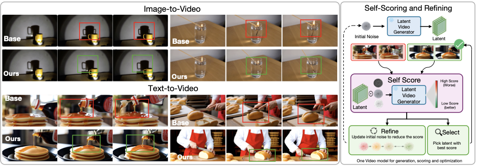

<h1>🌀 Proprio</h1>
<h3>Latent Self-Scoring and Inference-Time Refinement for Physically Plausible Video Generation</h3>

Mariam Hassan · Kaouther Messoud · Wuyang Li · Alexandre Alahi  
EPFL · Télécom Paris

---

## 📌 Overview

Modern video generative models produce visually impressive results, yet frequently violate basic physical principles. We propose Proprio, a training-free framework that enables a frozen video generator to assess and improve the physical plausibility of its own outputs. Inspired by *proprioception*, the biological sense of one’s own movement, Proprio treats the model's flow residual under controlled latent perturbations as a self-scoring signal. Samples that are better explained by the generator's learned dynamics induce smaller and more stable residuals. We aggregate this signal across timesteps and perturbations, focus it on motion-relevant regions with a dynamic spatiotemporal mask, and use it for best-of-N search, gradient-based self-refinement, or both. Across text-to-video and image-to-video benchmarks, Proprio consistently improves physical plausibility, outperforming VLM-based scoring and external world-model baselines in several settings. On TurboWan2.2, Proprio improves Physics-IQ from 32.2 to 37.5 (+16.5%) and VideoPhy2-hard physical commonsense from 45.6 to 55.0 (+20.6%). Human evaluation further shows that raters prefer Proprio-selected or refined videos for physical plausibility in roughly two-thirds of comparisons. These results suggest that frozen video generators contain actionable internal signals for evaluating and improving the physical plausibility of their own outputs.

## 🚧 Code

Code is **coming soon**.
